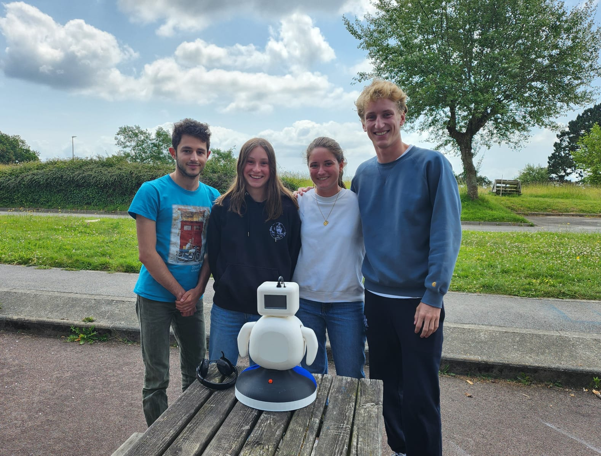

# WIKIBOT - projet PRONTO (projet de l'ingénieur dans un monde en transition)

> [!NOTE]
> 
> Un projet dans le cadre de notre première année en école d'ingénieur à IMT Atlantique visant la conception et fabrication intégrale d'un robot compagnon prénommé WIKIBOT.

WIKIBOT est un robot interactif capable de répondre à une requête vocale en utilisant Wikipedia, avec expressions faciales et mouvements corporels.

## Objectifs

> Modélisation et impression 3D de l'intégralité du corps du robot 

> Conception du montage électronique et choix des composants 

> Implémentation du code avec choix des librairies 

## Points abordés
* Gestion de projet : répartition des tâches, diagramme de Gantt et planification
* Conception de A à Z d'un robot modulaire à l'impression 3D intègrant les nombreux composants électroniques
* Traitement d'un signal audio: reconnaissance vocale, recherche d'une réponse sur le web, synthèse vocale
* Pilotage de servoomoteurs pour bouger Les bras et la tête 
* Invention de l'intégralité des étapes de l'interaction, en prenant en compte tous les cas de figure possible dont les potentiels disfonctionnement des librairies
* Communication des avancés au sein de l'équipe et avec nos encadrants

## Auteurs

Nous sommes une équipe de 4 étudiants de l'IMT Atlantique composée de: 
 
Louis BONDUELLE 
Coline FELTIN 
Florian THOLLOT 
et Astrid MARION 
