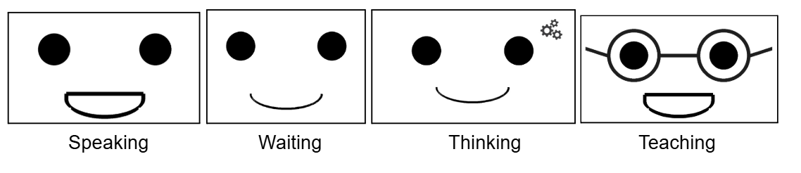

# WIKIBOT - projet PRONTO (projet de l'ingénieur dans un monde en transition)

> ℹ️ **Note**
> 
> Un projet dans le cadre de notre première année en école d'ingénieur à IMT Atlantique visant la conception et fabrication complète d'un robot compagnon que nous avons prénommé WIKIBOT.

Wikibot est un robot interactif capable de répondre aux questions vocales en utilisant Wikipedia, avec expressions faciales et mouvements corporels.

## Description
Ce robot compagnon est conçu pour interagir naturellement avec les utilisateurs à travers :

* **Reconnaissance vocale** : Écoute et comprend les requêtes (un seul mot ou groupe de mots) en français quand l'utilisateur maintient le bouton poussoir 

* **Recherche sur wikipedia** : Utilise Wikipedia pour fournir un résumé en une phrase de la page correspondante à la requête de l'utilisateur.

* **Synthèse vocale** : Répond avec une voix de synthèse

* **Expressions faciales** : Affiche différentes expressions sur écran selon le contexte: 
- Mode **waiting** : Visage souriant, sans mouvement lorsque le robot attend la requête de l'utilisateur
- Mode **thinking** : Sourire avec engrenages, sans mouvement lorsque le robot chreche la réponse
- Mode **teaching** : Lunettes avec une animation de la bouche pour donner les réponses lorsqu'elles sont trouvées
- Mode **speaking** : Animation de la bouche lorsque le robot n'a pas trouvé la réponse et lors de la phrase d'accueil

* **Mouvements** : Gesticule avec les bras et la tête pendant les interactions

### Etapes de l'interaction

|Etape     |Audio                                                                                          |Servomoteurs          | Expression visage |
|-----------|------------------------------------------------------------------------------------------------|-----------------------|---|
|Démarrage|Salutation et présentation                                                                     |Rotation des deux bras |speaking|
|Requête   |L'utilisateur maintient le bouton  poussoir et expose sa requête                             |/                     |waiting|
|Traitement|Enregistrement requête -> stt -> Recherche résumé wikipedia -> stt                              |/                     |thinking|
|Réponse*  |1. Sortie audio du résumé wikipedia  2. Lecture du fichier audio disant qu'il n'a pas compris|2. Rotation de la tête|1. teaching  2. speaking|

\* Dans le **cas 1.** la recherche wikipedia renvoie un résultat.  
Tandis que dans le **cas 2.** la recherche ne renvoie rien (cela peut être dû au fait qu'aucune requête n'a été donnée par l'utilisateur, que la connection wifi a sauté ou que la recherche n'a pas aboutie car le mot a mal été transcrit, qu'il existe plusieurs page associées ...)

## 6. Auteurs

Ce projet a été développé par 4 étudiants de l'IMT Atlantique dans le cadre du projet Pronto:

Astrid MARION
Louis BONDUELLE
Coline FELTIN
Florian THOLLOT
