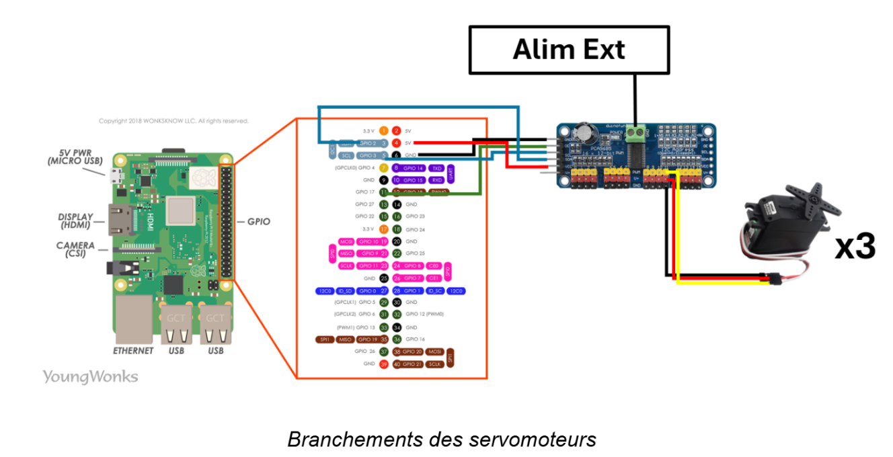
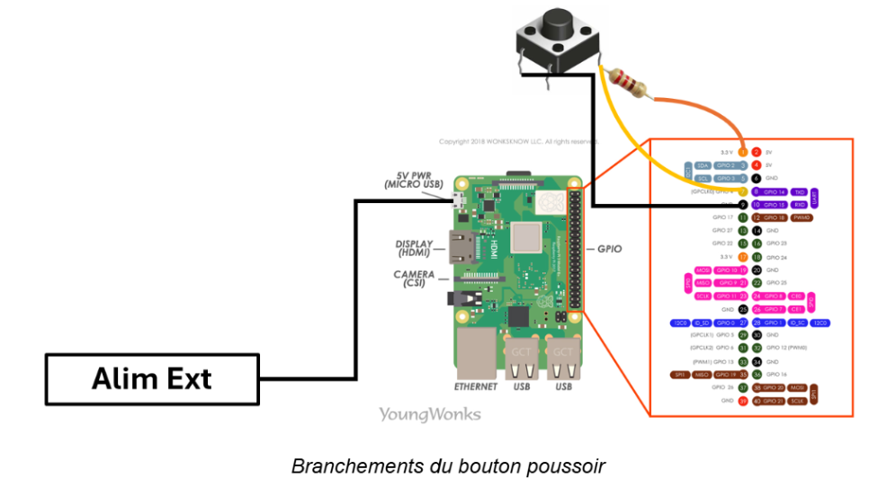
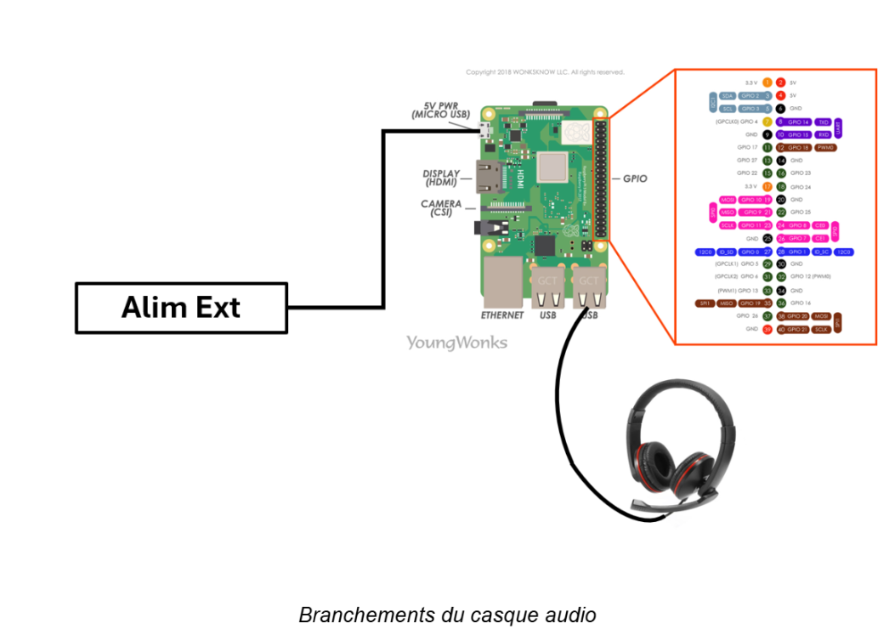
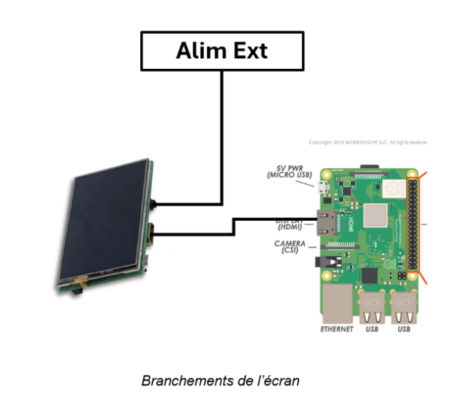

# Partie électronique/codage du système

Ce document est une description complète et détaillée des parties codage et électronique du système. <br>
Il a pour objectif d'apporter toutes les clés, étape par étape, de la réalisation du dispositif pour de futurs curieux ou passionnés.


## 1. Composants électroniques utilisés

- **Raspberry Pi 4 model b** avec GPIO pour l'interface matérielle
- **Casque USB** (/!\ la prise jack de la raspberry ne fournie pas d'entrée audio, donc il est nécessaire )
- **bouton poussoir**
- **résistance** (1 kΩ) 
- **Module de commande ADA815**
- **3 servomoteurs continues**
- **Ecran** LCD UCTRONICS B0106
- **Câbles**: alimentation raspberry avec boîtier (3A, 5.1V) / hub USB (2 ports) / câbles Dupont (x8) / HDMI-HDMI mini (pour l'écran) / USB-micro_USB (alim écran) / alim module servo / adaptateur USB-secteur 

## 2. Configuration Matériel et branchements

- **GPIO 4** : Bouton poussoir (pull-up interne)
- **GPIO 17** : Pin OE pour contrôle des servomoteurs
- **USB Port 1** : Microphone
- Servomoteurs sur le module:
    - **Canal 0** : Bras gauche
    - **Canal 1** : Tête
    - **Canal 2** : Bras droit

Ci-desous sont illustrés les branchements réalisés:<br>





## 3. Configuration Raspberry

- Installation de l'OS de la raspberry via Raspberry Pi Imager:
    - Système d'exploitation:  **Raspberry Pi OS (64-bit) (En ligne)**
    - Nom d’hôte: **rpi.local**
    - Nom utilisateur: **grp10**

- Activer l'I2C pour l'écran et le module de contrôle des servomoteurs: 
```bash
sudo raspi-config
> "Interfacing Options" 
> "I2C"
> Enable 
```
Pour vérifier les adresses I2C:
```bash
i2cdetect -y 1
```

- Choisir le bon port audio:
```bash
sudo raspi-config 
> systeme option 
> audio 
> choose USB
```

## 4. Structure du code et de l'environnement Raspberry

Il faut ensuite reproduire la structure suivante en clonant le dossier "code" du dépôt.
Il est préférable de reproduire cette structure à l'identique au risque d'avoir des erreurs de chemin d'accès lors de l'exécution, notamment à cause du fichier setup_autostart.sh qui doit se trouver au même niveau que l'environnement virtuel p10 (il faut donc le déplacer par rapport à sa position actuelle dans le dossier code).

```bash
grp10/                                      # Dossier utilisateur
├── setup_autostart.sh                      # Fichier de démarrage automatique après allumage
├── ...    
└── p10/                                    # Environnement virtuel Python
    ├── bin/
    ├── lib/
    ├── ...
    └── projet-pronto/                      # Dossier mère du projet
        ├── Main.py                         # Point d'entrée et orchestration principale
        ├── audio/
        │   ├── AudioProcessing.py          # Acquisition, reconnaissance et synthèse vocale
        │   ├── Speak.py                    # Lecture de fichiers audio
        │   └── preRecordedDialogs/         # Fichiers .wav pré-enregistrés pour les réponses courantes
        ├── screen/
        │   └── Screen.py                   # Gestion des expressions faciales
        ├── servo/
        │   ├── Servo.py                    # Contrôle des servomoteurs
        │   └── servo_preinit.sh            # Script d'initialisation pour éviter que les servomoteurs ne tournent au démarrage
        ├── lib/                            # Modèles et bibliothèques externes (à compléter) 
        │   ├── piper                       # librairie tts (fichier binaire à télécharger)
        │   ├── vosk-model-small-fr-0.22    # Modèle pour la reconnaissance vocale
        │   ├── fr_FR-siwis-medium.onnx     # Modèle de voix du robot
        │   └── fr_FR-siwis-medium.onnx.json
```

## 5. Librairies et modèles

- Audio
    - **sounddevice** (python): lire et enregistrer des tableaux NumPy contenant des signaux audio
    Pour l'installer, il faut au préalable installer **portAudio** via la commande suivante:
    ```bash
    sudo apt install portaudio19-dev libasound2-dev 
    ```

    - **pygame** (python): lire des fichiers .wav

    - **wikipedia** (python): rechercher des pages wikipedia et récupérer des résumés

    - **vosk** (python): pour la reconnaissance vocale
    Pour que la librairie fonctionne, il faut également télécharger un modèle de language via https://alphacephei.com/vosk/models.  
    Pour le projet nous avons choisi le model vosk-model-small-fr-0.22, déposé dans le dossier **lib/**.

    - **piper** (fichier binaire): librairie tts pour l'enregistrement des réponses du robot.

    Pour l'installer, télécharger a version 64-bits du fichier binaire via ce lien: https://github.com/rhasspy/piper, et placer ce dossier dans le répertoire **lib/**.

    Ensuite, télécharger le modèle de voix du robot via ce lien: https://github.com/rhasspy/piper/blob/master/VOICES.md. La version choisie pour le projet est **fr_FR-siwis-medium.onnx**.
    

- Ecran
    - **pygame** (python): dessiner et afficher les expressions du visage du robot
    - **math** (python): utiliser des fonctions courantes pour le dessin des traits

- Servomoteurs
    - **adafruit-circuitpython-servokit** (python): commander les servomoteurs

- Autres
    - **RPI.GPIO** (python): gérer les GPIO de la raspberry
    - **threading** (python): interfaces haut-niveau de fils d'exécutions multiples. Le fichier Main.py gère 4 types de fils d'exécution différents pour: le traitement de l'audio, la lecture de fichiers audios, les servomoteurs et l'écran. 

## 6. Démarrage automatique

Pour que le fichier Main.py s'exécute automatiquement à l'allumage du robot, le fichier bash setup_autostart.sh est nécessaire. De plus, pour éviter que les servomoteurs ne tournent pendant le démarrage du robot, le fichier **setup_autostart.sh** créer le fichier **/home/grp10/p10/projet-pronto/servo/servo_preinit.sh** pour éviter ce disfonctionnement.

1. Déplacer le fichier setup_autostart.sh vers le chemin **/home/grp10/setup_autostart.sh**
2. Rendre le fichier exécutable:
```bash
chmod +x setup_autostart.sh
```
3. Exécuter le fichier avec les privilège administrateur: 
```bash
sudo bash setup_autostart.sh
```