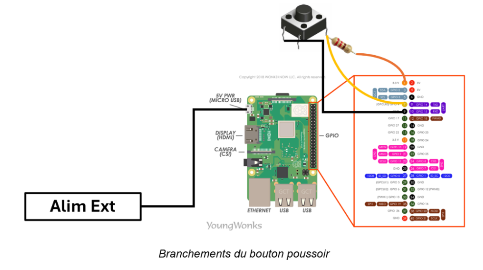

# Partie électronique/codage du système

Ce document est une description complète et détaillée des parties codage et électronique du système. <br>
Il a pour objectif d'apporter toutes les clés, étape par étape, de la réalisation du dispositif pour de futurs curieux ou passionnés.

## Sommaire

[[TOC]]

## Organisation de travail choisie

Afin de faciliter l’utilisation de la raspberry, nous avons choisi d’y connecter directement nos ordinateurs personnels via SSH grâce au partage de connexion de nos téléphones. <br>
Pour cela, nous avons connecté à la fois la raspberry et nos ordinateurs au même wifi, puis exécuté la commande suivante dans nos ordinateurs pour entrer dans le terminal de la raspberry:<br>
```bash
ssh grp10@rpi.local
```
Puis afin de partager nos avancées respectives sur l’implémentation du code, nous utilisons un dépôt git.


## Présentation de l'interaction

**Expressions faciales** : Affiche différentes expressions sur écran selon le contexte:<br>
- Mode **waiting** : Visage souriant, sans mouvement lorsque le robot attend la requête de l'utilisateur
- Mode **thinking** : Sourire avec engrenages, sans mouvement lorsque le robot chreche la réponse
- Mode **teaching** : Lunettes avec une animation de la bouche pour donner les réponses lorsqu'elles sont trouvées
- Mode **speaking** : Animation de la bouche lorsque le robot n'a pas trouvé la réponse et lors de la phrase d'accueil

<div align="center">

</div>

|Etape     |Audio                                                                                          |Servomoteurs          | Expression visage |
|-----------|------------------------------------------------------------------------------------------------|-----------------------|---|
|Démarrage|Salutation et présentation                                                                     |Rotation des deux bras |speaking|
|Requête   |L'utilisateur maintient le bouton<br> poussoir et expose sa requête                             |/                     |waiting|
|Traitement|Enregistrement requête -> stt -> Recherche résumé wikipedia -> stt                              |/                     |thinking|
|Réponse*  |1. Sortie audio du résumé wikipedia<br> 2. Lecture du fichier audio disant qu'il n'a pas compris|2. Rotation de la tête|1. teaching<br> 2. speaking|

\* Dans le **cas 1.** la recherche wikipedia renvoie un résultat. <br>
Tandis que dans le **cas 2.** la recherche ne renvoie rien (cela peut être dû au fait qu'aucune requête n'a été donnée par l'utilisateur, que la connection wifi a sauté ou que la recherche n'a pas aboutie car le mot a mal été transcrit, qu'il existe plusieurs page associées ...)


## 1. Composants électroniques utilisés

- **Raspberry Pi 4 model b** avec GPIO pour l'interface matérielle
- **Casque USB** (/!\ la prise jack de la raspberry ne fournie pas d'entrée audio, donc il est nécessaire d'utiliser un port USB )
- **bouton poussoir**
- **résistance** (1 kΩ) 
- **Module de commande ADA815** [https://cdn-shop.adafruit.com/datasheets/PCA9685.pdf] nécessaire pour contrôler 3 servomoteurs car la raspberry n'en supporte pas autant
- **3 servomoteurs continues**
- **Ecran** LCD UCTRONICS B0106 [https://cdn.robotshop.com/media/a/adu/rb-adu-41/pdf/uctronics-35-tft-lcd-touch-screen-pen-raspberry-pi-datasheet.pdf]
- **Câbles**: alimentation raspberry avec boîtier (3A, 5.1V) / hub USB (2 ports) / câbles Dupont (x8) / HDMI-HDMI mini (pour l'écran) / USB-micro_USB (alim écran) / alim module servo / adaptateur USB-secteur 

## 2. Configuration Matériel et branchements

- **GPIO 4** : Bouton poussoir (pull-up interne)
- **GPIO 17** : Pin OE pour contrôle des servomoteurs
- **USB Port 1** : Microphone
- Servomoteurs sur le module:
    - **Canal 0** : Bras gauche
    - **Canal 1** : Tête
    - **Canal 2** : Bras droit

Ci-desous sont illustrés les branchements réalisés:<br><br>




## 3. Configuration Raspberry

- Installation de l'OS de la raspberry via Raspberry Pi Imager:
    - Système d'exploitation:  **Raspberry Pi OS (64-bit) (En ligne)**
    - Nom d’hôte: **rpi.local**
    - Nom utilisateur: **grp10**

- Activer l'I2C pour l'écran et le module de contrôle des servomoteurs: 
```bash
sudo raspi-config
> "Interfacing Options" 
> "I2C"
> Enable 
```
Pour vérifier les adresses I2C:
```bash
i2cdetect -y 1
```

- Choisir le bon port audio:
```bash
sudo raspi-config 
> systeme option 
> audio 
> choose USB
```

## 4. Structure du code et de l'environnement Raspberry

Il faut ensuite reproduire la structure suivante en clonant le dossier "code" du dépôt.
Il est préférable de reproduire cette structure à l'identique au risque d'avoir des erreurs de chemin d'accès lors de l'exécution, notamment à cause du fichier setup_autostart.sh qui doit se trouver au même niveau que l'environnement virtuel p10 (il faut donc le déplacer par rapport à sa position actuelle dans le dossier code).

```bash
grp10/                                      # Dossier utilisateur
├── setup_autostart.sh                      # Fichier de démarrage automatique après allumage
├── ...    
└── p10/                                    # Environnement virtuel Python
    ├── bin/
    ├── lib/
    ├── ...
    └── projet-pronto/                      # Dossier mère du projet
        ├── Main.py                         # Point d'entrée et orchestration principale
        ├── audio/
        │   ├── AudioProcessing.py          # Acquisition, reconnaissance et synthèse vocale
        │   ├── Speak.py                    # Lecture de fichiers audio
        │   └── preRecordedDialogs/         # Fichiers .wav pré-enregistrés pour les réponses courantes
        ├── screen/
        │   └── Screen.py                   # Gestion des expressions faciales
        ├── servo/
        │   ├── Servo.py                    # Contrôle des servomoteurs
        │   └── servo_preinit.sh            # Script d'initialisation pour éviter que les servomoteurs ne tournent au démarrage
        ├── lib/                            # Modèles et bibliothèques externes (à compléter) 
        │   ├── piper                       # librairie tts (fichier binaire à télécharger)
        │   ├── vosk-model-small-fr-0.22    # Modèle pour la reconnaissance vocale
        │   ├── fr_FR-siwis-medium.onnx     # Modèle de voix du robot
        │   └── fr_FR-siwis-medium.onnx.json
```

## 5. Librairies et modèles

- Audio
    - **sounddevice** (python): lire et enregistrer des tableaux NumPy contenant des signaux audio
    Pour l'installer, il faut au préalable installer **portAudio** via la commande suivante:
    ```bash
    sudo apt install portaudio19-dev libasound2-dev 
    ```

    - **pygame** (python): lire des fichiers .wav

    - **wikipedia** (python)[https://pypi.org/project/wikipedia/]: rechercher des pages wikipedia et récupérer des résumés

    - **vosk** (python) [https://pypi.org/project/vosk/]: pour la reconnaissance vocale
    Pour que la librairie fonctionne, il faut également télécharger un modèle de language via https://alphacephei.com/vosk/models.  
    Pour le projet nous avons choisi le model vosk-model-small-fr-0.22, déposé dans le dossier **lib/**.

    - **piper** (fichier binaire): librairie tts pour l'enregistrement des réponses du robot.

    Pour l'installer, télécharger a version 64-bits du fichier binaire via ce lien: https://github.com/rhasspy/piper, et placer ce dossier dans le répertoire **lib/**.

    Ensuite, télécharger le modèle de voix du robot via ce lien: https://github.com/rhasspy/piper/blob/master/VOICES.md. La version choisie pour le projet est **fr_FR-siwis-medium.onnx**.
    

- Ecran
    - **pygame** (python): dessiner et afficher les expressions du visage du robot
    - **math** (python): utiliser des fonctions courantes pour le dessin des traits

- Servomoteurs
    - **adafruit-circuitpython-servokit** (python): commander les servomoteurs

- Autres
    - **RPI.GPIO** (python): gérer les GPIO de la raspberry
    - **threading** (python)[https://docs.python.org/fr/3.8/library/threading.html]: interfaces haut-niveau de fils d'exécutions multiples. Le fichier Main.py gère 4 types de fils d'exécution différents pour: le traitement de l'audio, la lecture de fichiers audios, les servomoteurs et l'écran. 

## 6. Démarrage automatique

Pour que le fichier Main.py s'exécute automatiquement à l'allumage du robot, le fichier bash setup_autostart.sh est nécessaire. De plus, pour éviter que les servomoteurs ne tournent pendant le démarrage du robot, le fichier **setup_autostart.sh** créer automatiquement le fichier **/home/grp10/p10/projet-pronto/servo/servo_preinit.sh** pour éviter ce disfonctionnement.

1. Déplacer le fichier setup_autostart.sh vers le chemin **/home/grp10/setup_autostart.sh**
2. Rendre le fichier exécutable:
```bash
chmod +x setup_autostart.sh
```
3. Exécuter le fichier avec les privilège administrateur: 
```bash
sudo bash setup_autostart.sh
```

## Conclusion
### - Difficultés rencontrées dans cette partie

Ne connaissant pas le fonctionnement de la Raspberry, au début du projet, nous installions les bibliothèques sur la raspberry avec la commande sudo apt install, ce qui nous a valu de réinstaller intégralement l’OS, car les librairies étaient éparpillées sur tout le système et créent des conflits. <br>
Cela nous a fait perdre un temps considérable car de très nombreux problèmes liés à cette mauvaise pratique nous ont empêchés d’avancer, notamment la librairie wikipedia qui renvoyait systématiquement des erreurs d’encodage.<br>
Après discussions avec les encadrants de notre projet, nous nous sommes donc tournés vers un environnement virtuel où nous avons fait tout notre projet (installation des librairies et programmation du robot).<br>

Problèmes matériels résolus: <br>
- Le micro et le haut parleur doivent être branchés sur le même port USB.
- Il était souvent difficile d’anticiper tous les composants et donc on se retrouve à ne pas trouver les bon câbles pour le branchement. Je pense par exemple au micro et au haut-parleur que nous comptions brancher sur la prise jack alors que cette dernière ne traite que la sortie audio et non l’entrée.
- Un autre problème est survenu durant la réalisation de notre projet. En effet, nous nous sommes rendu compte qu'alimenter la raspberry directement sur secteur en 230V alternatif présente un risque d’endommagement de la raspberry et ne permet pas d’utiliser tout le potentiel du système. Nous avons donc dû changer de Raspberry pour un model pi 4 car nous n’avions pas les câbles nécessaires pour le model pi 3 que nous avions choisi à l’origine.
- La raspberry possède une seule sortie PWM commandée par un système intégré, ce qui nous a poussés à utiliser une carte de contrôle.
- Pour faciliter l’écoute en temps réel et que notre robot ne soit pas sur écoute sans arrêt, nous avons décidé d’installer un bouton poussoir que l’utilisateur maintiendrait lorsqu’il veut exposer sa requête pour faciliter le processus.
- Nous avons également choisi, par manque de temps et puisque nous n’avons pas réussi à faire fonctionner le micro (défaillance du matériel commandé), d’utiliser un casque audio qui règle tous nos problèmess et le tout est sur une prise USB.

### - Perspective d'amélioration

Voici quelques piste d'améliorations possibles du robot:

- Changer le casque audio pour de vrais micro et haut-parleur.
- Faire en sorte que wikipedia ne renvoie pas de phonétique dans le résumé de la page, car piper ne parvient pas à le lire avec son modèle de voix.
- Ajouter un régulateur de tension pour centraliser les 3 alimentations.

